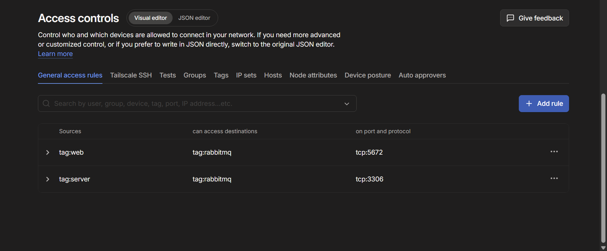

# fire wall configurtion
---
I first created tags to assign to each vm, web tag for webclient vm, server tag for databasevm , and rabbitmq tag for kag644-1. Tags are needed so we can assign roles to the vms and allow us to reference machines when creating firewall rules. Grants follow a default-deny / zero trust model meaning everything that is not explicitly allowed is rejected. i allowed web to communicate back and forth with rabbitmq through tcp protocol port 5672 as this is the assigned port for communication to rabbitmq with web. i also allowed rabbitmq to communicate back and forth with server. Server currently hosts both database and dmz, the grant allows for communication via tcp on port 3306. By setting these grants access between web and server is rejected as it wasnt granted therefore fulfilling the requirement of having reject rules in the firewalls

sources used: :https://tailscale.com/docs/features/access-control/acls